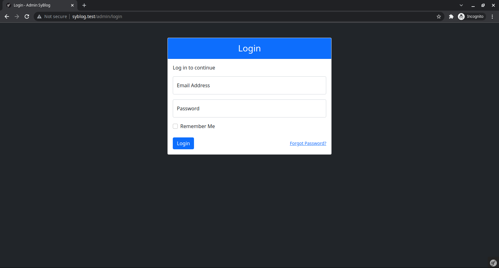
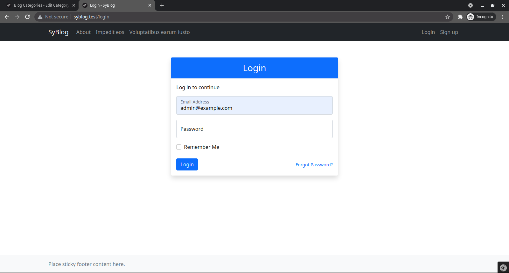
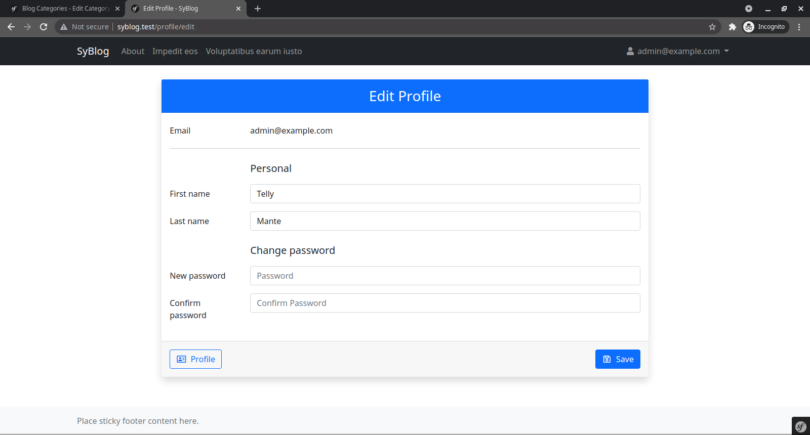
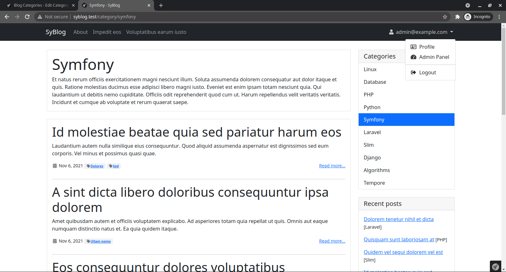
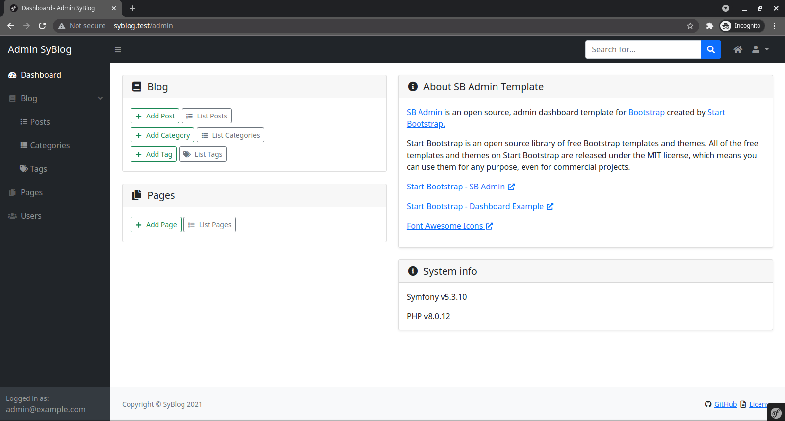
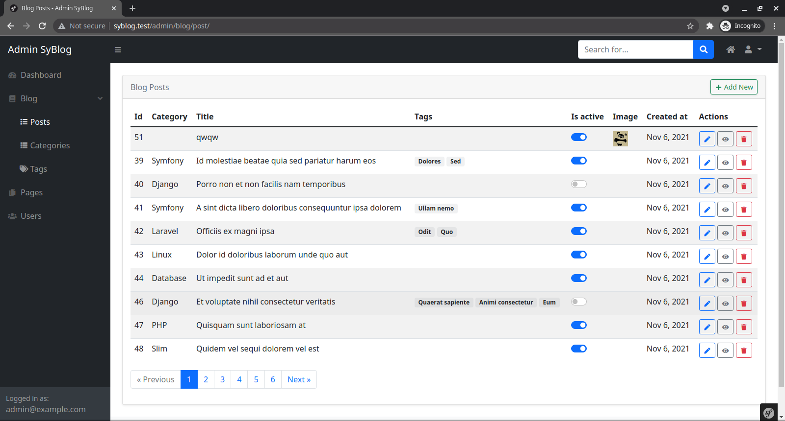

# Symfony Blog

I started to get familiar with the `Symfony` framework.

As a starting point, I decided to create a simple blog starting from scratch.

I will be using the latest MySQL, PHP, Symfony for now.

## Approximate plan

Implementation steps:
- Install the framework `Symfony` and start the server
- Separation front and admin area, each with its own a skeleton template
  - front: [Bootstrap 5](https://getbootstrap.com)
  - admin: [SB Admin](https://startbootstrap.com/template/sb-admin)
- Registration, authentication, authorization (separate forms for front and admin areas)
- Users with roles: `ROLE_USER`, `ROLE_ADMIN`, `ROLE_SUPER_ADMIN`

### In the admin area
- Dashboard
- Blog management
  - Posts
  - Categories
  - Tags
- Page management
- User management

---

## Install

You have locally installed: php8, mysql, composer, nodejs, npm, yarn, symfony
```
git clone git@github.com:amberlex78/syBlog.git
cd syBlog
cp .env.example .env
composer install
yarn install
yarn encore dev
make db-seed
symfony server:start -d
```

## Install via Docker

Add to `/etc/hosts` file line `127.0.0.1 syblog.test`

```
git clone git@github.com:amberlex78/syBlog.git
cd syBlog
cp .env.example .env
```

### Up
Docker up: `docker-compose up -d` or:
```
make init
```

Seeding data:
```
make seed
```

### Down
Docker down: `docker-compose down --remove-orphans` or:
```
make down
```
See all command in `Makefile` file.

See database connection in `docker-compose.yml` and config in `.env` file.

## Access to site

Front:
```
https://127.0.0.1:8000
```
Front for Docker:
```
http://syblog.test
```

Admin:
```
https://127.0.0.1:8000/admin
```
Admin for Docker:
```
http://syblog.test/admin
```

### Users
```
user@example.com   - User
admin@example.com  - Admin
sadmin@example.com - Super Admin
```
Password: `password`

## Screenshot













